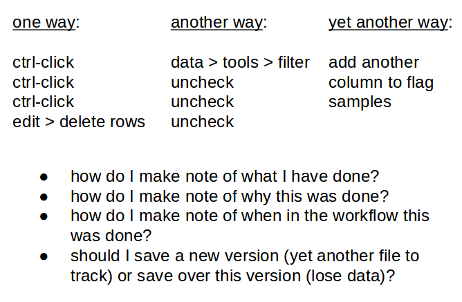
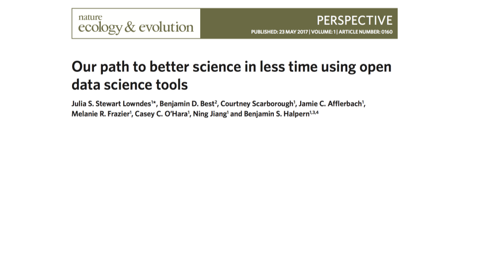

```{r setup, include = FALSE}
options(htmltools.dir.version = FALSE)
```

```{r libraries, include = FALSE, eval = FALSE}
library(dplyr)
library(kableExtra)
```

class: middle

#### course overview

* An introduction to tools and techniques that will help you to organize, work with, and publish your research data.

* Hands-on exercises with example data, or your own data if available.


---
class: middle

#### learning outcomes

1. Understand the benefits of a structured approach to managing research data.
    
2. An introduction to tools and techniques to aid the implementation of
   workflows that facilitate reproducible researh.

3. Be able to organize data and prepare metadata to facilitate publication of
   research data.
    
4. Recognize data and metadata quality issues and understand the impact on the
   value of the data.
    
5. Apply data management principles to prepare a Data Management Plan as
   required by many funding agencies.

---
class: middle, inverse

#### office hours

- campus: before class  
- Zoom: by appointment (just about any time)


---
class: middle, center

# 75 minutes


---
class: middle, center, inverse

### readings, materials, assignments


---
class: middle

#### evaluation

.small[
  | component                                | percentage |
  | :--------------------------------------- | ---------: |
  | GitHub account                           |         10 |
  | student participation*                   |         10 |
  | data structure                           |         15 |
  | literate programming                     |         15 |
  | data management plan (DMP) + review      |      20+10 |
  | creating metadata + review               |       15+5 |
]

.small[
We encourage **student participation**. Evidence of being prepared for
discussion in class, including but not limited to having completed reading
assignments prior to class, contributing insightful comments, and a commitment
to class activities will demonstrate levels of preparedness and participation
that enable others to learn from and with you.
]


---
class: middle

#### research data workflow: this is your world (or it will be soon)


.footnote[J. Bryan from http://stat545.com/]


---
class: middle

* what if something changes, what if something needs to be redone - how do you manage that?

--

* where did I get these data?

--

* how did I make that figure?


???

#### how to manage workflow

committe meeting scenario:
- figure x and table x are contradictory
- redo the analyses without omitting samples


---
background-image: url(https://media.giphy.com/media/MEtSuIu6qu0HC/giphy.gif)
background-position: 50% 50%
background-size: 50%
class: inverse

<br>

*basically, if the thought of redoing your analyses is terrifying then you are doing it wrong*  
<br>
J. Bryan

???

#### you are doing it wrong


---
class: middle

#### research data workflow: this is your world (or it will be soon)
.light-blue[now add to that publishing your data and code]


.footnote[
J. Bryan from http://stat545.com/
]


---
class: middle

**reproducible research** is the ability to recompute data analytic results, given an observed data set and knowledge of the data analysis pipeline.

.footnote[
Peng 2015 [*The reproducibility crisis in science: A statistical counterattack*](https://doi.org/10.1111/j.1740-9713.2015.00827.x)
]

???

#### reproducible research


---
class: middle

.center[
</img>
]

.footnote[
Peng 2011 [*Reproducible Research in Computational Science*](10.1126/science.1213847)
]

???

#### reproducibility spectrum

- including the code is important because it documents the decision-making process (Powers and Hampton 2019)


---
class: middle, inverse

Replicating studies remains the gold standard for rigorous scientific research, but reproducibility is increasingly viewed as a *minimum standard* that all scientists should strive toward.

.footnote[
Alson and Rick 2021 [*A Beginner's Guide to Conducting Reproducible Research*](https://doi.org/10.1002/bes2.1801)
]

???

#### minimum standard


---
class: middle

**reproducibility for scientific reasons**

* increased trustworthiness
* more rigorous, reliable science
* learning more from one another's work

  
.footnote[
Thompson 2018 [*The Life & Times of a Reproducible Clinical Project in R*](https://bit.ly/jlt-rmed2018)
]

???

#### reproducibility for scientific reasons

---
class: middle

**reproducibility for personal reasons**

- helps researchers remember how and why they did *x*
- enables researchers to quickly and simply modify figures, tables, etc.
- enables quick reconfiguration of previously conducted research tasks

  
.footnote[
Alson and Rick 2021 [*A Beginner's Guide to Conducting Reproducible Research*](https://doi.org/10.1002/bes2.1801)
]

???

#### reproducibility for personal reasons


---
class: middle, center

# how?


---
class: middle

- version control
- environments
- project organization
- naming things
- data formats
- metadata


---
class: middle

most basic principle for reproducible research is to **do everything via code**

* downloading data from the web
* converting an Excel file to CSV
* renaming columns or variables
* omitting bad samples or data points

*...do all of these programatically*

.footnote[Broman 2016 [*Steps toward reproducible research*](https://bit.ly/jsm2016)]

???

#### everything by code


---
class: middle

#### learn a language, any language, just do it

.pull-left[
  
]

.pull-right[
  
]


---
class: middle

#### spreadsheets: the dark side

.center[
  
]


---
class: middle

#### spreadsheets versus scripting

consider, we want to remove samples that we feel may have been contaminated...

.pull-left[

  **in a R script**
  <hr>
  ```r
  some work...
  ```
  

.small[
.light-blue[
  *comment code:* remove samples 4 and 5 that may have been compromised due to wading upstream during sampling
  ]
]
  
  ```r
  chemistry_data %>%
    filter(!sampleID %in% c(4,5))
  ```
  
  ```r
  ...more work
  ```
]

.pull-right[

  **in a spreadsheet**
  <hr>
  
  
]


---
background-image: url(https://media.giphy.com/media/PnXRAFOJFCt3i/giphy.gif)
background-position: 50% 50%
background-size: 50%
class: inverse

#### I am not saying it is easy


---
class: middle

#### OHI: nature ecology & evolution

.center[
  
]

.footnote[
Lowndes et al. (2017) [*Our path to better science in less time using open data science tools*](https://www.nature.com/articles/s41559-017-0160)
]


---

#### OHI: evolution of a workflow

.center[
  
]

.footnote[
Lowndes et al. (2017) [*Our path to better science in less time using open data science tools*](https://www.nature.com/articles/s41559-017-0160)
]


---
class: middle, inverse

Kieran Healy on two revolutions in computing:

"On one side, the mobile, cloud-centered, touch-screen, phone-or-tablet model has brought powerful computing to more people than ever before."

"On the other side, tools for coding, data analysis, and writing are also revolutionary but mostly work by gluing together separate, specialized widgets that do much less to hide the operation system layer, and require knowledge of things like the file system."


.footnote[
Healy 2020 [*The Plain Person's Guide to Plain Text Social Science*](https://kieranhealy.org/files/papers/plain-person-text.pdf)
]


---
class: middle, center


???

#### text bubble
